### SQL处理流程
#### 概述
在典型的关系数据库管理系统或是数据仓库系统中，SQL引擎是一个重要的模块，主要是处理接收到的SQL,并返回结果。SQL引擎处理一个SQL，一般分为下面三个阶段：
1，sql解析，主要是将用户的输入文本（SQL）,转化成一个内部的数据结构，一般称之为语法解析树，并验证语法的正确性，最终得到一个表示SQL的语法解析树。

2，查询优化，将前一个阶段的语法解析树，进行基于规则以及基于物理代价的优化，生成一个最优的查询计划。

3，执行查询计划，将前一阶段生成的查询计划予以执行，将结果返回给用户。
通常，为了方便区分每个阶段处理过程中的中间产物，我们将整个SQL引擎分成四个层次，每个层次中有其对应的输入和输出的主要结构。

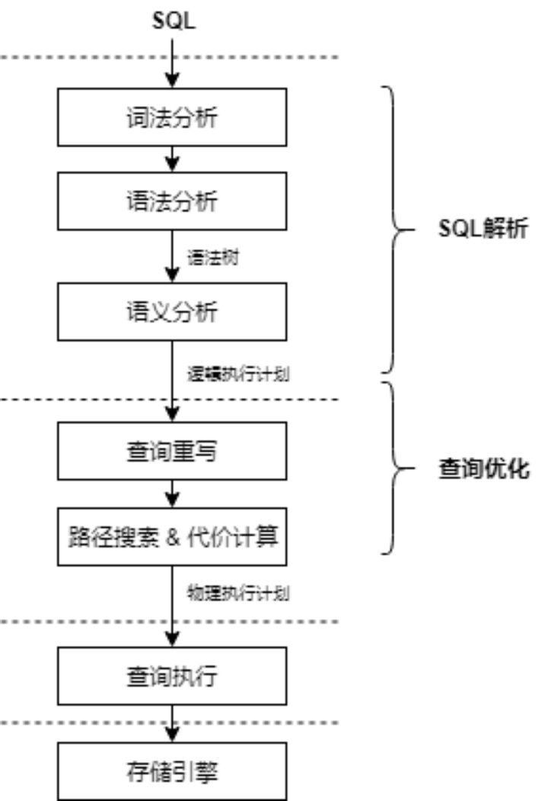

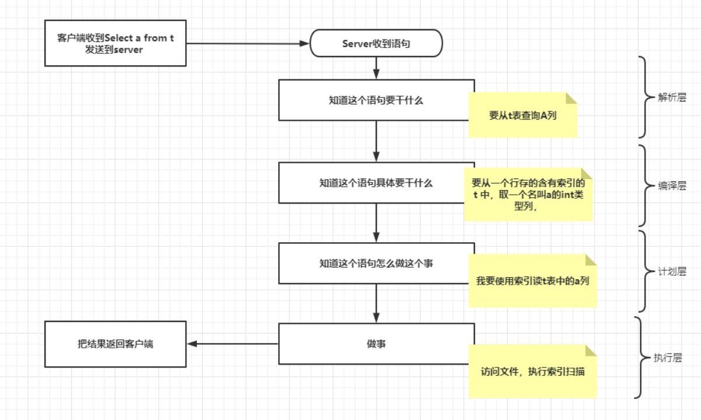

#### 解析层

##### PE\PBE

解析层是server 收到客户端发送的命令，并对此条命令进行解析，明确这个语句要做什么，根据定义好的方法如何将网络传输的协议内容识别成数据库程序可以解析的内容。openGauss目前的协议可以分为两种PE(simple Query) PBE(extend Query)。

PE协议的内容来源通常是通过gsql客户端发送出的语句，对应处理的函数为exec_simple_query。PBE协议的内容来源通常是通过JDBC接口发送的数据，虽然有些可视化数据库连接工具中，使用的没有参数的SQL语句，但是仍然属于使用PBE协议传输的范畴，只是BIND阶段没有信息而已。

PBE对应的处理函数有三个： exec_parse_message ，exec_bind_message， exec_execute_message。

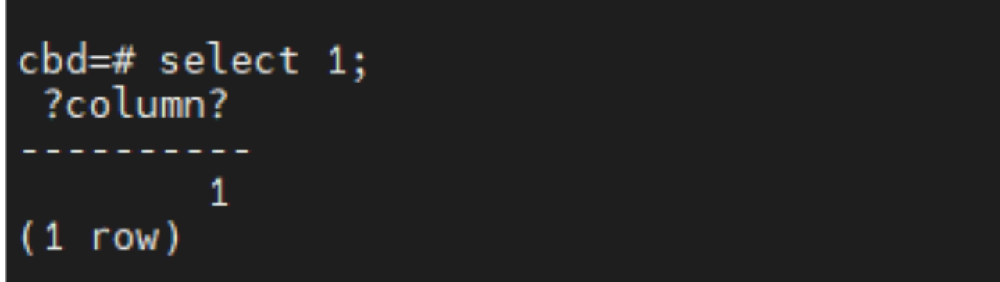

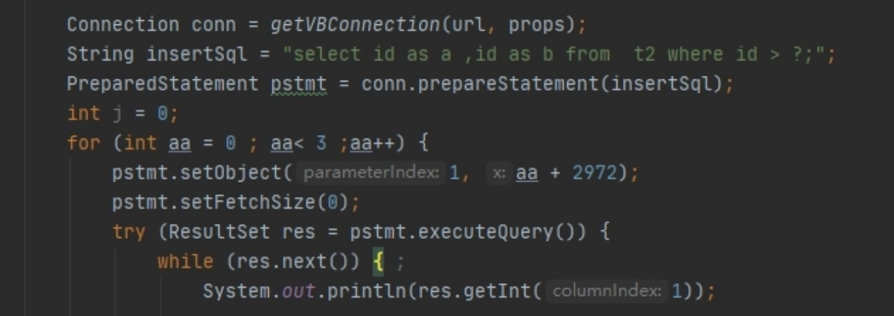

1. parse 阶段：parse 阶段会生成一个参数化的执行计划，这个计划中含有等待bind阶段绑定的参数，这个解析结果会被保存在一个缓存中，缓存的格式是一个 CachedPlanSource，它主要保存了解析树、查询树。主要是为了后文复用这个内容生成计划，这可以减少解析、构建计划的次数。

2. Bind阶段：bind阶段会将参数信息填充到parse阶段生成的内容中，构建一个执行计划CachedPlan对象，并构建一个Portal执行器对象。这里在构建计划的时候，也会有一个计划的缓存内容，具体解释可以被简化为，可以构建一个含有占位符的执行计划，真正执行是将占位符对应的实际值带人进行运算。当然也在某些场景中，需要根据参数值的不同生生一个更加合理的计划，这里可以被一个GUC参数强制控制，否则可能会导致生成不符合真正预期的计划，set enable_pbe_optimization = 0。

3. execute 阶段：execute阶段会使用bind阶段生成的一个portal对象，执行这个portal，执行时，有一个结果集的fetch行数的限制，所以意味者不是所有结果一次性返回到客户端，而是一次返回一部分，当我们需要继续向后获取时，此portal会继续上次执行的状态，这也就导致了释放这个portal的时机和simple_query的是不同的。后文，我们将忽略PBE协议的处理，以Simple_query 的方式讲述后文的各个部分的处理逻辑。

##### 词法分析

词法分析，一般是借助lex这样得工具，定义一些识别终结符的规则。Lex根据这些规则，将一段字符组成的内容解析成对应类型的终结符，例如数字、字符串、运算符号等等。

在内核中，此处走的文件是scan.l，base_yylex函数。所谓词法分析进入的阶段是在解析协议接口的内容时，进入parser阶段所做的第一件事，意味着我们需要明确每个token的含义，转化字符内容为语法分析模块可以识别的信息。这部分内容中，将根据预先定义好的规则，来匹配每个token 究竟属于那种类型。

词法分析中，我们经常用到一些不好理解的变量，只有调试时才可以明确其内容，以下是部分内容的说明。

除了下表描述的结构外，我们在日常修改中，最多使用的是yyextra， 记录一些词法语法分析阶段的额外信息。

| 变量或函数名 | 说明                                                |
| ------------ | --------------------------------------------------- |
| yytext       | 变量，所匹配的字符串                                |
| yyleng       | 变量，所匹配的字符串的长度                          |
| yyval        | 变量，与标记相对应的值                              |
| yylex        | 函数，调用扫描器，返回标记                          |
| yyless       | 函数，将yytext中前n个以外的字符，重新放回输入流匹配 |
| yymore       | 函数，将下次分析的结果词汇，接在当前yytext的后面    |
| yywrap       | 函数，返回1表示扫描完成后结束程序，否则返回0        |

首先vbase内部定义了一些关键字，这些关键字被分为三种，保留关键字、非保留关键字、列名关键字。保留关键字级别最高，一般不会随意增加。列名关键字就是可以出现在列名中，识别为列名的关键字，这里描述的列名和我们常说的列名含义不同，会在下文语法分析部分做详细描述。非保留关键字级别上比较低，可以出现在大部分为普通的标识符的地方。其余的符号、数字内容等，也有规则能将其匹配为适当的终结符。

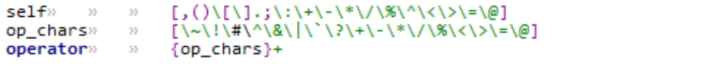

词法扫描时，我们可以看到一些类似<xc>的规则，这表示开启一个规则后的特殊处理，也就是存在某些情况，多个token组合成为一个终结符的情况。例如一段注释/* xxx */，需要词法分析部分可以将/* ...*/之间的所有内容识别成一个注释段落，其中的内容不论是任何，全部忽略，那么这时候就需要这种特殊的规则让词法分析进入特定的逻辑，也就是{xcstart} 规则开启了xc方式，直到匹配到xc结束，再返回信息或者匹配后面的非注释内容。

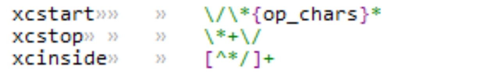

在词法分析时，每个token之间以空白符作为token之间的区分，这也为我们撰写语法规则提供了一个基础。

词法：

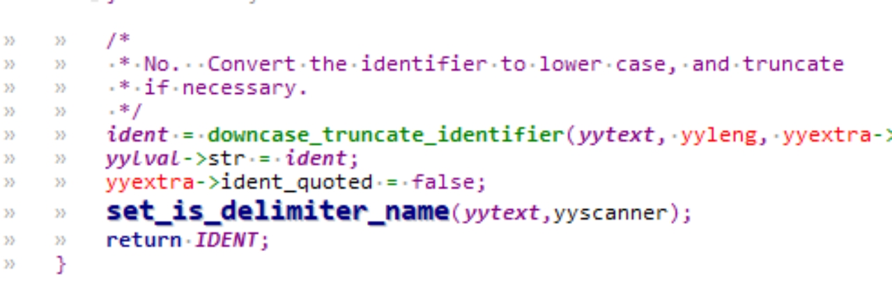

语法：

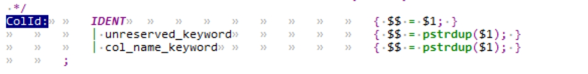

##### 语法分析

语法分析是一系列语法规则的集合。这些语法规则定义了如何用终结符来组成某个语法。这些语法规则是左递归文法，借助常用的语法分析器，使用左递归的方式来解析词法规则分析出来的终结符，使用语法解析树才存储这些解析出来的终结符。最终，这些语法解析树代表了当前输入的SQL语句。

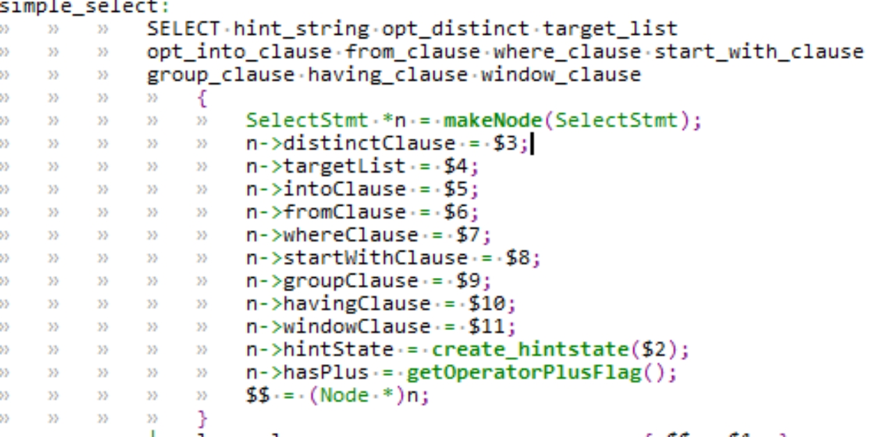

语法分析使用词法分析的结果，来组合成一个语法规则，在新增语法规则时，经常会遇到语法冲突，为解决部分语法冲突，通常使用提升关键字等级、拆分合并语法规则、优先级调整、组合终结符识别方式的方法来处理语法冲突，使其可以按照我们规划的方式去匹配。考虑解决冲突前，先确认冲突从何产生，也就是说，有些情况下明明两个语法有明显的不同，为何不能区分出来呢？语法可以说是多个终结符的组合，虽然组合的最终形态有所差异，但是在语法分析的过程中，是一个自底向上的过程，它用到一个分析栈 (parser stack)，关键有两个动作

1. 移进 (shift)读取的 token 移进到分析栈中。

2. 归约 (reduce)

   当分析栈顶的 n 个符号匹配某规则的右端时，用该规则的左端取代之。

移进不难理解，规约的含义就是如下CopyStmt:	COPY opt_binary qualified_name opt_column_list opt_oids			copy_from...			

copy_from:			FROM 						{ $$ = TRUE; }			

​								| TO						{ $$ = FALSE; }

当读取到FROM 时，需要from被规约成copy_from 继续后文的识别，这便是一个规约的操作

自底向上算法要做的事情是，对于一个接一个读入的 token，何时移进，何时归约。LR(1) 中的 1表示，只需预读 1个终结符，就可以确定是移进，还是归约。总的来说，我们需要预读一个终结符后，能明确是移进还是规约，如果无法确认的情况产生了，那么就会产生所谓的语法冲突。 select a from t1;大致的分析过程

| **token** | **动作** | **分析栈**                     |
| --------- | -------- | ------------------------------ |
| select    | 移进     | SELECT                         |
| a         | 移进     | SELECT IDENT                   |
|           | 规约     | SELECT a_expr                  |
|           | 规约     | SELECT target_list             |
| from      | 移进     | SELECT target_list FROM        |
| t1        | 移进     | SELECT target_list FROM IDENT  |
|           | 规约     | SELECT target_list from_clause |
|           | 规约     | simple_select                  |
|           | 规约     | SelectStmt                     |

使用简单的例子表述各种解决冲突的方案如下：    

1. 提升关键字等级这个操作即为将非保留提升为保留或者列名关键字。因为gram.y定义了几个比较常用的表示命名内容的语法段，例如：ColId，type_function_name 等，这些内容中包含非保留关键字，若读取到一个非保留关键字时APPEND，他可以被规约到ColId，也可以移进到APPEND本身，那么提升关键字等级可以解决，但是一般不推荐。   

2.  拆分合并语法规则这个也是常用的规则，简单的例子是如下：opt_funcname: IDENT| /* empty */当没有token时，是否应该被规约到opt_funcname便受到外层影响，可以拆分外层为两个语法即可。

3. 优先级调整这个使用概率不大，通常使用 %prec xx 的方式描述为局部提升优先级使用。这种通常用在expr 的处理中，影响比较深远的语法，负号的判断就使用的这样一个逻辑，优先级提升后，会优先使用负号。就好像算数运算一样，我们需要先乘除后加减，这样的情况我们就需要把乘法符号的优先级高于加减，但是也不是所有都是这样的规则，例如 -1 *2 就需要让-1 作为一个整体，所以要提升负号的优先级

   gram.y中%定义的部分为优先级和结合性说明，优先级按照从上向下的方式定义，结合分为左结合和右结合和不结合。关于其他优先级和结合性的特点可以自行查阅。

4. 组合识别终结符这个也是一个比较常见的操作，组合识别的终结符具有保留关键字的特性，除了直接调用外没有被任何预制规则所包含，所以在此处冲突基本不会存在。

   例如一个语法

   DO expr

   | Do Sconst

   我需要对这两种语法不同的处理逻辑，但是expr中包含了SCONST，导致无法确认应该SCONST应该是移进还是规约成expr。这里就可以使用特殊处理，将DO 识别后，读下一个token ，如果是DO SCONST将其识别为 DO_SCONST作为一个终结符，这样就不会有这样的冲突，也就是在读取到DO时候，提前读一个，属于特殊操作，如果不是SCONST则重置这个读操作即可。

   语法分析结果是一个语法分析树，通常是一个xxxStmt的格式，传递给语义分析模块，至此，一条语句已经从一个字符串转化为内部结构，已经明白这个语句在做什么。

#### 编译层

pg_analyze_and_rewrite

在得到当前SQL语句的语法解析树之后，我们需要验证下当前的语法解析树在语义上是否正确。这个会从多个方面来检查当前的语法解析树：例如当前所访问的表名、列名是否存在、调用的函数是否存在、函数调用的参数类型是否正确等等。

这里走到函数pg_analyze_and_rewrite，语义分析使用语法分析树的内容，产生查询树结构，查询树就是Query结构体。

在产生Query结构体时，根据语法解析时产生的不同解析树，对其内容进行转化和验证。

在一条查询语句中，比较常见的几个转化函数为：

transformColumnRef

转化列信息

transformAExprOp

转化操作符信息

transformFuncCall

转化函数信息

语法分析的过程中，query结构体被一层一层的信息所填入。

query 结构体填充完成后，会进行重写操作，这个重写是查询树级别的重写，进入函数pg_rewrite_query

这里，会对一些预制好的重写规则进行应用，例如create table as select 语句就会被重写为两个Query结构体，一个表示create table 操作，一个表示insert select 操作。

语义解析阶段为了验证部分信息的准确性，会读取部分系统表中的内容，这部分读取的过程基本被SysCache相关接口所封装，syscache 的读取接口已经包含了直接从系统表中读取数据到缓存的过程。

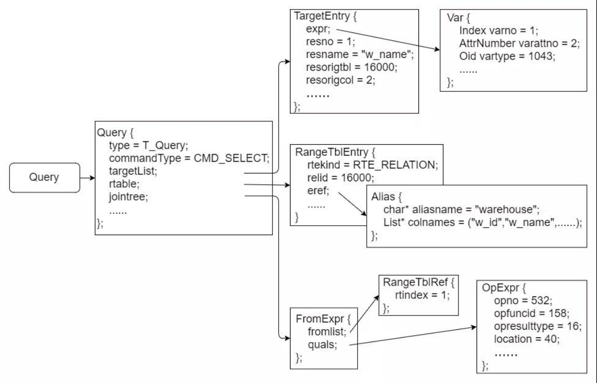

#### 计划层

##### 逻辑优化（RBO）

pg_plan_queries

逻辑优化依照如下两个原则:

一，等价性：原语句和重写后的语句，输出结果相同。

二，高效性：重写后的语句，比原语句在执行时间和资源使用上更高效。

关于如何应用关系代数的定律实现基于规则的优化，可以在图书《数据库系统实现》5.2-5.3中详细参考其证明方法和理论依据

在代码中，subquery_planner会按照如下规则检查query并进行优化。

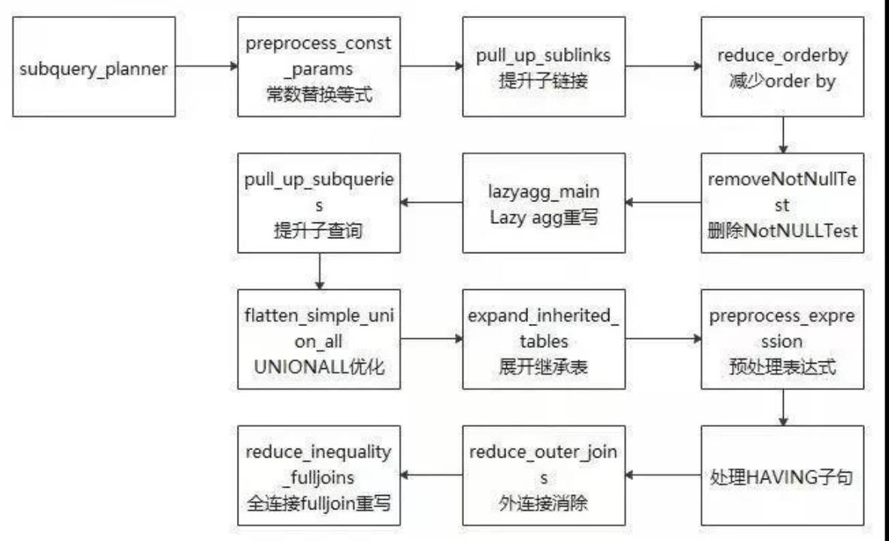

preprocess_const_params 

递归扫描查询的jointree，并对其中找到的每个相等条件执行子query_planner的预处理工作，以在可能的情况下用常量值替换参数

replace_empty_jointree

将没有使用表的子查询增加一个伪造的表，主要用来保证后续可以正常应用其它规则。

pull_up_sublinks

子连接提升，通常伴随着ANY/ALL/IN/EXISTS/SOME等谓词同时出现。虽然子链接从语句的逻辑层次上是清晰的，但是效率有高有低，比如相关子链接，其执行结果和父查询相关，即父查询的每一条元组都对应着子链接的重新求值，此情况下可通过提升子链接提高效率。在该部分数据库主要针对ANY和EXISTS两种类型的子链接尝试进行提升，提升为Semi Join或者Anti-SemiJoin。

reduce_orderby

子查询中的order by排序后可能并无作用，多进行的排序运算不影响整体查询结果时，会去除子查询中的排序信息

inline_set_returning_functions

处理一些返回值是结果集合的函数，它们如果表示的是一个简单的查询，那么它可以被替换成一个子查询。

##### 物理优化（CBO）

物理优化，是在前面逻辑优化的基础上，基于代价来选择物理计划的路径。一般需要选择的物理计划包括：

一，表的扫描，可以选择索引扫描或是全表扫描。

二，连接的执行方式和顺序，连接可以有nest_loop join hash join 和sort merge join等方式，在某些情况下连接的方式可以调换，例如A inner join B，和B inner join A是等价的。OpenGauss和PG中，才有了动态规划算法、遗传算法来计算最优的连接方式和顺序，默认是使用动态规划算法；

三，执行分组、聚集的方式，可以选择基于hash的方式、或是基于排序的方式。    

物理路径的选择根据的是当前路径执行的代价，代价是根据代价模型从实际数据的特点计算得来的，计算代价的第一步是获得正确的数据特征。

根据统计信息，可以计算出某个条件对于表，预计可以过滤多少条数据。或者join连接的预期结果集行数，以一个简单的例子来看如何计算出选择率。

可以将断点设置在clause_selectivity中， scalargtsel函数真正计算选择率信息

向表t1 中插入六条数据 ，analyze t1 , 再插入一条数据。

经过调试，我们可以看出，选择率为0.6666。此表中有六行数据，那么认为可以选择4条。

由于统计信息不新，所以实际选择了五条数据。

explain analyze select a from t1  where t1.a > 3;                                         

QUERY PLAN-------------------------------------------------------------------------------------------- 

Seq Scan on t1  (cost=0.00..1.07 rows=4 width=4) (actual time=0.041..0.044 rows=5 loops=1)   

Filter: (a > 3)   

Rows Removed by Filter: 2 

Total runtime: 0.185 ms

(4 rows)

当计算完成选择率后，我们就可以使用预估出来的结果行数来评估一个合理的代价。

考虑如下场景：t10中有十万条数据为Mike,1000条数据为Annie

explain select id from t10 where name = 'Annie';                                

 QUERY PLAN----------------------------------------------------------------------------- 

[Bypass] 

Index Scan using idx_t10_name on t10  (cost=0.00..101.58 rows=1134 width=4)   

Index Cond: (name = 'Annie'::text)

(3 rows)

cbd=# explain select id from t10 where name = 'Mike';                         

QUERY PLAN------------------------------------------------------------ 

Seq Scan on t10  (cost=0.00..17923.49 rows=999865 width=4)   

Filter: (name = 'Mike'::text)

(2 rows)

代价信息主要分为两部分：

IO代价和CPU代价

以上文选择顺序扫描的计划为例，经过调试，我们不难发现，索引扫描的代价要高于全表扫描的代价。这里使用的numIndexPages是使用了选择率估算出的要扫描的元组数量估算出的数值。而随机页扫描的代价默认为4，顺序页扫描代价为1。

关于CPU代价的计算方式可以参考代码中注释描述，不做详细展开。

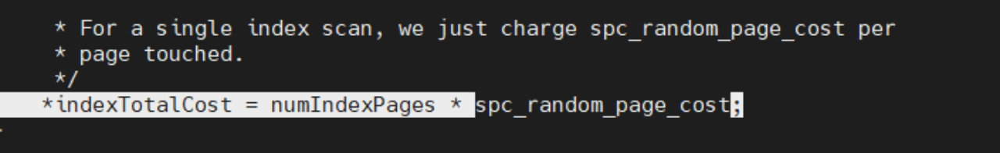

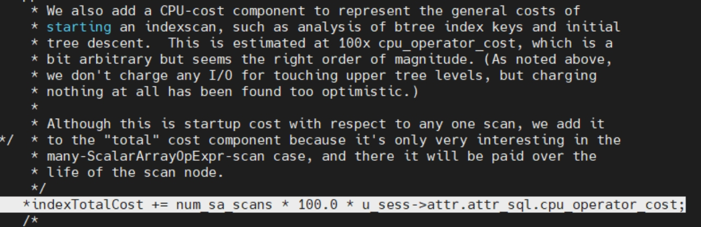

代价计算完成后，会将这条路径增加到待选择路径队列中，这里表示路径的内容是一个PATH结构体。最终通过函数choose_best_path 选择一条物理路径。

多个路径组合成一个物理计划，从而使执行器执行其描述内容，选择算子。

除了选择扫描的路径外，一个比较重要的路径选择是join路径的选择，尤其涉及到多个表的join时，应如何进行剪枝，减少搜索的空间。

关于VB目前比较重要的两个计算jion连接的算法可以参考如下文章中描述。https://blog.csdn.net/GaussDB/article/details/119668883

优化器中的物理优化主要目的是利用统计信息计算出每个算子执行完毕所使用的代价信息，并利用代价信息选择最优的路径，组织成一个完整的执行计划。

#### 执行层

执行器接收Plan（优化器输出），对Plan做转换处理，生成状态树，状态树的节点对应执行算子（这些算子利用存储和索引提供的接口，实现数据读写）；执行器是SQL语句同存储交互的中介。这些执行算子有统一的接口以及相似的执行流程（初始化、迭代执行、清理3个过程）。

在VB内部，执行器被定义为Portal 对象，每个Portal 都会经历初始化，执行，清理这三个过程，分别会在不同的阶段调用不同函数执行相应的内容。

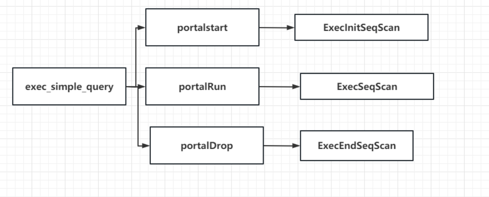

一，初始化阶段，先初始化左右孩子节点，然后初始化本节点，主要是申请相应的资源，以及设置执行的上下文环境；

二，执行阶段，先执行左右孩子节点，获得输入的记录，然后在本节点的上下文中执行本节点的处理逻辑，处理完之后返回给上层节点，直至下层节点没有输入，最顶层节点将最终输出返回给用户；

三，销毁阶段，自顶向下，调用左右孩子的处理函数释放资源和执行上下文，然后释放本节点的资源和上下文。

由于执行器使用的火山模型，需要上层的执行节点找下层的节点获取数据，数据返回的类型是一个TupleTableSlot，可以粗略的认为就是一个tuple和一些辅助信息。

VB中算子被分为很多种。

| **算子类型** | **说明**                       |
| ------------ | ------------------------------ |
| 控制算子     | 处理特殊执行流程，如Union语句  |
| 扫描算子     | 用于扫描表对象，从表中获取数据 |
| 物化算子     | 缓存中间执行结果到临时存储     |
| 连接算子     | 用于实现SQL中的各类join操作.   |

控制算子：

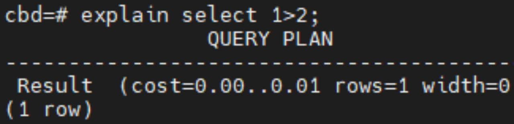

扫描算子:

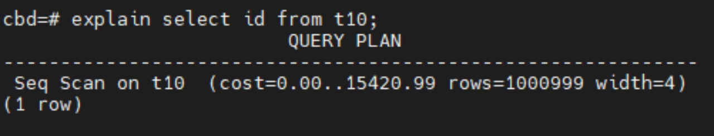

连接算子：

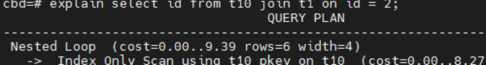

物化算子：

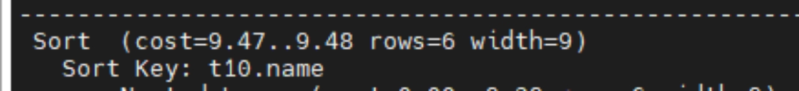

执行器每执行到ExecutePlan 函数时，都会发送元组（需要发送时）。也就是说，执行完成一轮后就会将元组调用printtup 接口，准备将内容返回到客户端。

当最下层执行算子返回空时，会将NULL值向上传递，这也就意味着这个执行器完成了他获取结果集的工作。这时，就可以销毁执行器对象了。

对于PBE协议的执行来讲，比较特殊的是其会保存执行器的状态，这样做的原因是可能存在没有fetch 所有结果集的情况。具体来说是会记录当前每个算子执行的位置，在继续fetch结果集的时候，继续这个位置后的操作，达到继续执行的目的。

那么执行器的销毁阶段被滞后了，如果fetch 所有结果集后，返回的NULL值仍然可以作为执行器结束的标志，否则只能当下一个同名的执行器对象被初始化后，才会被销毁。

执行器的名字通常是匿名的，匿名意味着有相同的名字。如果是命名的执行器，那么就需要根据名称来判断销毁同名的执行器对象，这是比较特殊的处理逻辑，希望可以帮助未来开发时规避一些由于此情况带来的问题。

#### SQL执行流程总结

主要描述的还是查询语句的执行流程。对于DML、DDL语句其执行过程有差异但是也都经历了如上所述的一些过程。通过学习PPT中的内容，期望能对整体的SQL引擎有初步的认识和理解，对于每个层次的输出产物、输入内容有概念。

理解从QueryString -> Stmt解析树 -> Query 查询树 -> Plan 查询计划-> PlanState(执行状态）-> TupleSlot（结果集） 经历的主要流程。

需要对代码整体流程以及关键结构体有所掌握，并在应用实践中不断总结才能做到更好的理解。
